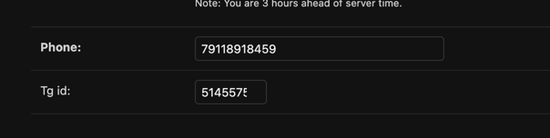

# Скрины с функционалом проекта

### 1. Скрины работоспособности проекта при выполнении команды `docker compose up -d`

### 2. Скрины работоспособности создания подписок на пользователя

### 3. Скрин по работоспособности создания товаров (заказов) для пользователя

### 4. Скрины на работоспособность кастомной миддлевар

### 5. Скрины по созданию новой модельки пользователя CustomerUser

### 6. Скрины по запуску телеграмм бота и по работоспособности команды

### 7. Скрины по отправке сообщений в телеграмм боте после создания заказа

